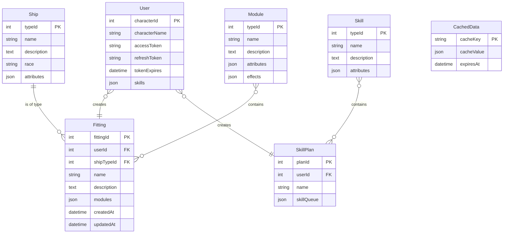

# Entity-Relationship Diagram

This diagram visualizes the relationships between the core data entities in the EveHelper application.

```mermaid
erDiagram
    "User" }o--|| "Fitting" : "creates"
    "User" }o--|| "SkillPlan" : "creates"
    "Ship" ||--o{ "Fitting" : "is of type"
    "Module" }o--o{ "Fitting" : "contains"
    "Skill" }o--o{ "SkillPlan" : "contains"

    "User" {
        int characterId PK
        string characterName
        string accessToken
        string refreshToken
        datetime tokenExpires
        json skills
    }

    "Fitting" {
        int fittingId PK
        int userId FK
        int shipTypeId FK
        string name
        text description
        json modules
        datetime createdAt
        datetime updatedAt
    }

    "SkillPlan" {
        int planId PK
        int userId FK
        string name
        json skillQueue
    }

    "Ship" {
        int typeId PK
        string name
        text description
        string race
        json attributes
    }

    "Module" {
        int typeId PK
        string name
        text description
        json attributes
        json effects
    }

    "Skill" {
        int typeId PK
        string name
        text description
        json attributes
    }

    "CachedData" {
        string cacheKey PK
        json cacheValue
        datetime expiresAt
    }
``` 